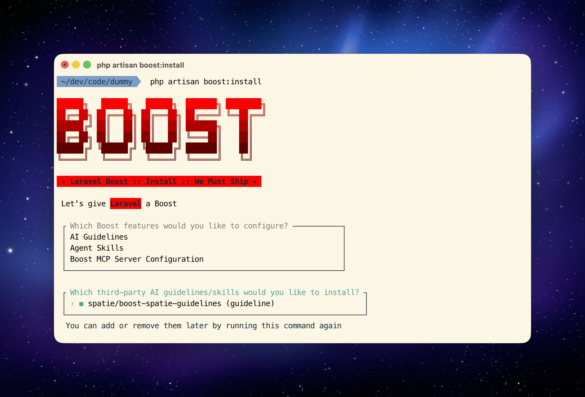

# Spatie Guidelines for Laravel Boost

[](https://packagist.org/packages/spatie/boost-spatie-guidelines)
[](https://packagist.org/packages/spatie/boost-spatie-guidelines)

Bring Spatie's battle-tested Laravel & PHP coding guidelines to your AI-assisted development workflow with Laravel Boost.

## Installation

Install the package via Composer:

```bash
composer require spatie/boost-spatie-guidelines --dev
```

Then install the guidelines with Boost:

```bash
php artisan boost:install
```



Select the Spatie guidelines from the list and they'll be installed to `.ai/guidelines/boost-spatie-guidelines/`.

## What's Included

This package provides AI-optimized versions of Spatie's Laravel & PHP coding standards, including:

- PSR compliance (PSR-1, PSR-2, PSR-12)
- Type declarations and nullable syntax
- Class structure and property promotion
- Control flow patterns (happy path, early returns)
- Laravel conventions (routes, controllers, configuration)
- Naming conventions (camelCase, kebab-case, snake_case)
- Blade templates and validation
- Testing best practices

These guidelines help AI assistants like Claude Code generate code that follows Spatie's proven standards.

## Support us

[](https://spatie.be/github-ad-click/boost-spatie-guidelines)

We invest a lot of resources into creating [best in class open source packages](https://spatie.be/open-source). You can support us by [buying one of our paid products](https://spatie.be/open-source/support-us).

We highly appreciate you sending us a postcard from your hometown, mentioning which of our package(s) you are using. You'll find our address on [our contact page](https://spatie.be/about-us). We publish all received postcards on [our virtual postcard wall](https://spatie.be/open-source/postcards).

## Usage

Once installed, AI assistants using Laravel Boost will automatically reference these guidelines when generating code. No additional configuration needed!

## Keeping Guidelines Up to Date

Re-run the Boost installer after updating the package to refresh guidelines:

```bash
composer update spatie/boost-spatie-guidelines
php artisan boost:update
```

## Full Guidelines

View the complete, human-readable guidelines at [spatie.be/guidelines](https://spatie.be/guidelines).

## Changelog

Please see [CHANGELOG](CHANGELOG.md) for recent changes.

## Contributing

Please see [CONTRIBUTING](https://github.com/spatie/.github/blob/main/CONTRIBUTING.md) for details.

## Security Vulnerabilities

Please review [our security policy](../../security/policy) on how to report security vulnerabilities.

## Postcardware

You're free to use this package, but if it makes it to your production environment we highly appreciate you sending us a postcard from your hometown, mentioning which of our package(s) you are using.

Our address is: Spatie, Kruikstraat 22, 2018 Antwerp, Belgium.

We publish all received postcards [on our company website](https://spatie.be/open-source/postcards).

## Credits

- [Freek Van der Herten](https://github.com/freekmurze)
- [All Contributors](../../contributors)

## License

The MIT License (MIT). Please see [License File](LICENSE.md) for more information.
